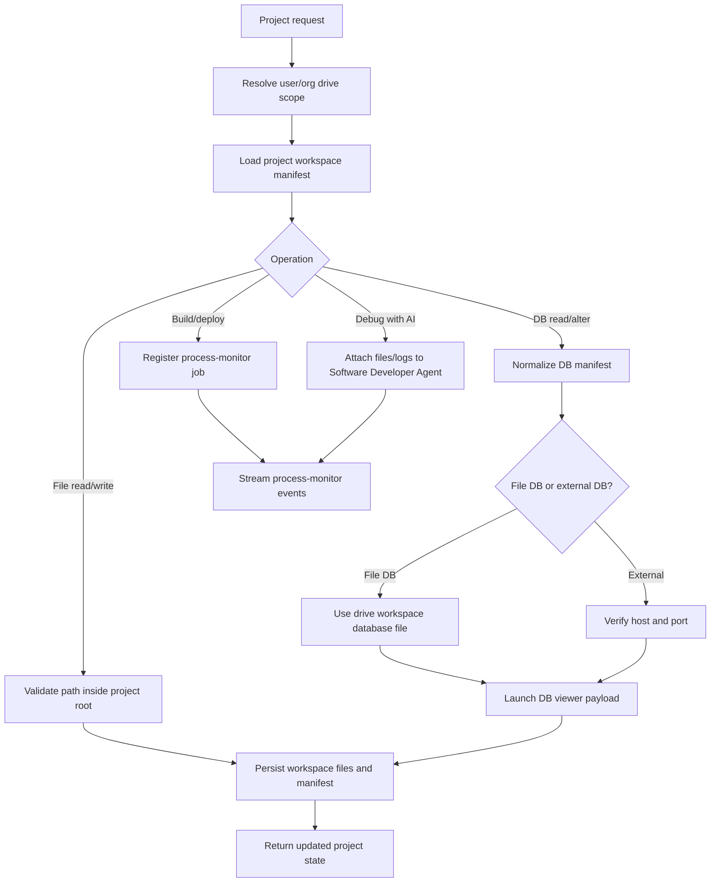

# AI-Agent Projects README

AI-Agent Projects are frontend-controlled workspaces for generated or edited software. They connect project files, file-based databases, external database connections, build/deploy jobs, preview metadata, and the Software Developer AI Agent.

## What users can do

- Create, edit, preview, build, and deploy a project.
- View, edit, add, and update project files from the frontend.
- Store project workspaces on the kube-mounted User Drive or Organisation Drive.
- Use file-driven databases inside the same drive workspace.
- Verify external database host/port reachability before using it in a project.
- Launch a DB viewer URL for the configured file database or external database connection.
- Chat with the Software Developer AI Agent to fix errors, explain logs, propose patches, and rerun validation.

## Database rules

AI-Agent Projects prefer file-driven databases because they can stay inside the user's or organisation's mounted drive. Supported file database modes include SQLite, SQLite3, DuckDB, Kuzu/graph database files, JSON/document DB files, LowDB/Loki-style JSON, PGlite, RxDB, and generic file-database manifests.

External databases are allowed only as verified connections. The project stores non-secret connection metadata and verifies host/port reachability through `aiAgentProjectVerifyExternalDatabase`. Secrets must stay in the credentials vault, not in project metadata.

The `aiAgentProjectLaunchDatabaseViewer` mutation returns a launch payload for the configured DB viewer. Giga does not vendor DBeaver or CloudBeaver source into the repo. It opens the configured `CLOUDBEAVER_URL`, `DBEAVER_WEB_URL`, or `/db-viewer` route with project, engine, connection, and file/external parameters.

## Observable project decision chain

## Build and deployment rules

- Build and deployment are queued as monitored processes and return a `processId` immediately.
- Runtime events include `processId`, `scopeType`, `userId`, `parentScopeId`, CPU, RAM, and status.
- Build output updates `runtime_manifest.previewUrl`.
- Deployment output updates `runtime_manifest.deploymentUrl`.
- The workspace manifest is written to the mounted drive so the Software Developer Agent can inspect project artifacts without relying on frontend state alone.

## Evaluation checklist

- File writes never escape the project workspace root.
- File-driven database paths stay under the User Drive or Organisation Drive.
- External databases have a verification result before the viewer is launched.
- DB viewer launch returns a payload and does not copy DBeaver code into Giga.
- Build/deploy jobs are visible in Process Monitor and can be stopped or killed.
- Debug-with-AI receives real project files, runtime manifests, logs, and UI Kit markdown context.
